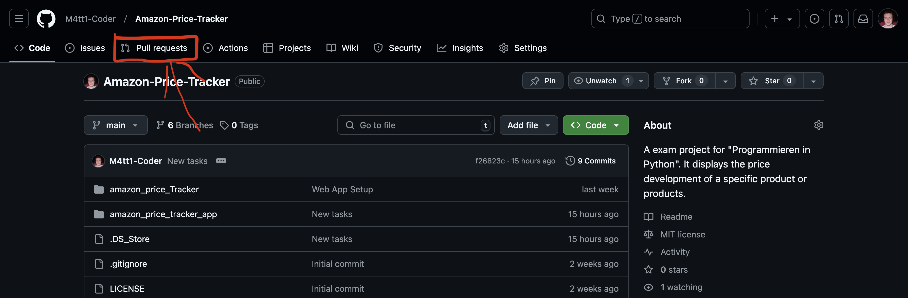
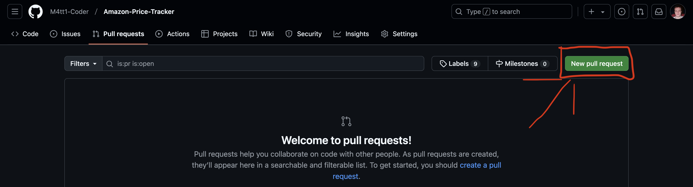
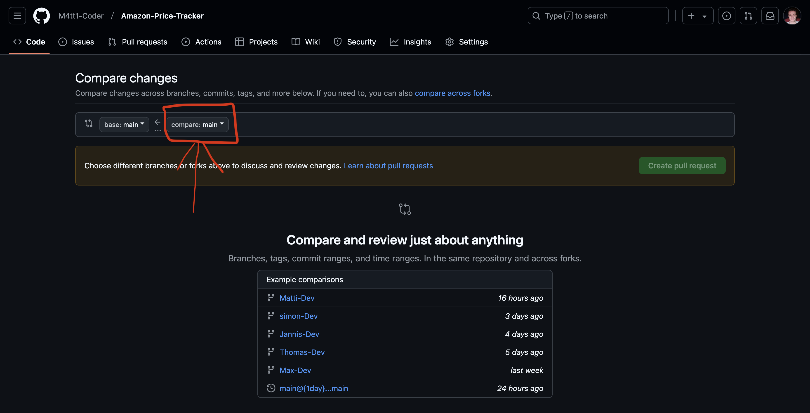
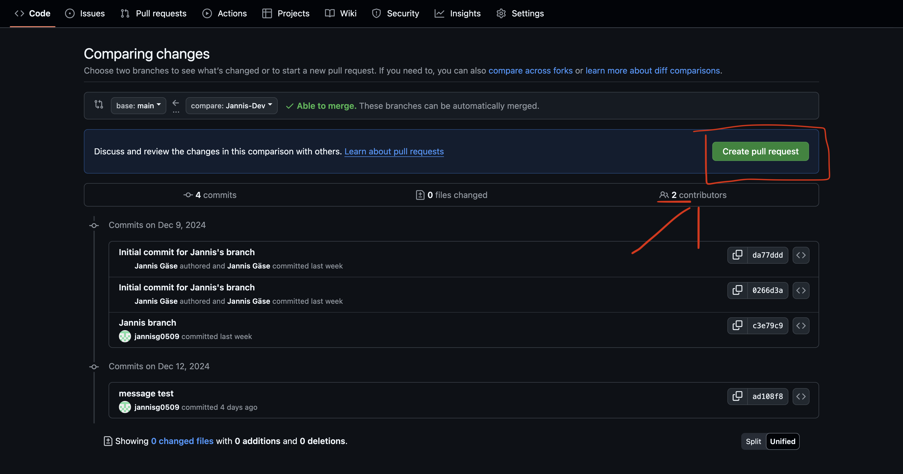
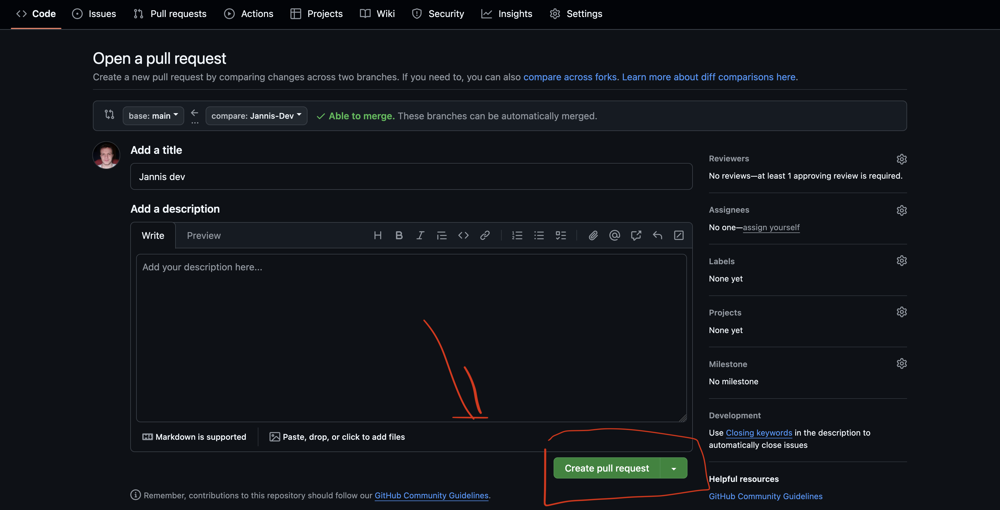
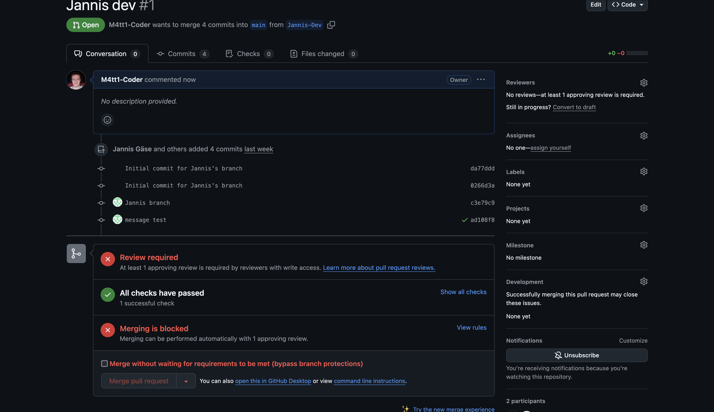
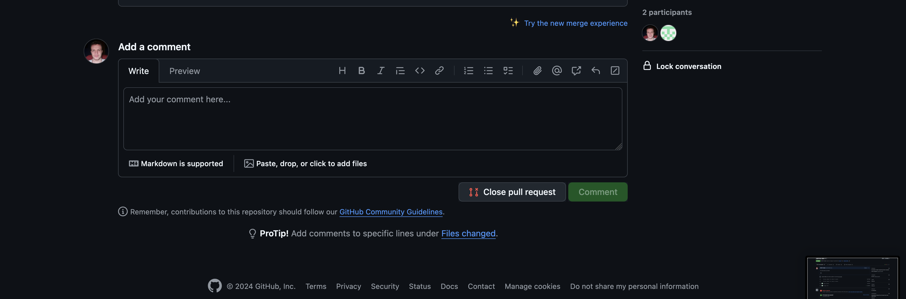

# Amazon-Price-Tracker
An exam project for "Programmieren in Python". It shows the price and its development of a specific product.

## Setup

### Django

You need to setup a virtual enviroment for the developing with Python and Django.

- [Virtual enviroment](https://docs.python.org/3/tutorial/venv.html)
- [Install Django](https://docs.djangoproject.com/en/5.1/topics/install/)
- [Install important packges in your virtual environment]

#### Templating in Django

In Django we use HTML templates to render content on the viewport! 

Visit the [official documentation](https://docs.djangoproject.com/en/5.1/topics/templates/) for more information!

### GitHub

#### Pull the repo to your local machine

If you want to pull the latest version of the repository to your local machine and start coding with it, you need to pull it from GitHub using `Git`.

Please refer [here](https://git-scm.com/downloads) if you haven't installed it already!

To check if you it setup on your PC:
```bash
  git -v
```
... output should be:
> git version 2.47.1

After making sure you have `Git` installed, you can pull the repository to a folder of your liking. Open a terminal in that directory and enter the following command into your command line:
```bash
  git clone https://github.com/M4tt1-Coder/Amazon-Price-Tracker.git
```

The repo is now installed and ready to go but you need to install all Python packages to start developing.

#### Merge a branch into another

To have your personal branch up-to-date with the `main`-branch you need to merge it into your own!

First switch to the `main`-branch:
```bash
  git checkout main
```
Then pull possible commits from the remote branch:

```bash
  git pull
```
Now, switch back to your branch:

```bash
  git checkout <nameOfYourBranch>
```
... merge the changes made in `main` into yours:

```bash
  git merge main
```
There is a chances that you encounter a merge conflict. In that case please visit [this](https://docs.github.com/en/pull-requests/collaborating-with-pull-requests/addressing-merge-conflicts/resolving-a-merge-conflict-using-the-command-line) site to learn more how to resolve the problem!

All important changes are now in the branch you work in!

#### Create a Pull Request

If you are ready with you features, then you can create [Pull Request](https://docs.github.com/en/pull-requests/collaborating-with-pull-requests/proposing-changes-to-your-work-with-pull-requests/about-pull-requests) to merge your changes into the default branch.

On the first landing page, there is a section called **`Pull requests`**:



Click on the tag `Pull requests`!

Now you get to a page, where all open pull requests are listed!



Next, click on the button `New pull request`!



So, here you need to select a branch to compare changes with! Click on the same button / field as marked in the image!

Click on `Create pull request` to continue!



You will get to a new page, where you can add a title and description to your pull request! I recommend doing that, because it allows your team members to understand, why you did what you did!



After adding your text, click on `Create pull request`!

You will see something like this! Now you have created a new pull request, I will review the new pull request and possibly merge it into the main branch!




## How to run the app?

Please refer [here](https://git-scm.com/downloads) if you haven't installed it already!

To check if you it setup on your PC:
```bash
  git -v
```
... output should be:
> git version 2.47.1

After making sure you have `Git` installed, you can pull the repository to a folder of your liking. Open a terminal in that directory and enter the following command into your command line:
```bash
  git clone https://github.com/M4tt1-Coder/Amazon-Price-Tracker.git
```

The repo is now installed and ready to go but you need to install all Python packages to start developing.

#### Merge a branch into another

To have your personal branch up-to-date with the `main`-branch you need to merge it into your own!

First switch to the `main`-branch:
```bash
  git checkout main
```
Then pull possible commits from the remote branch:

```bash
  git pull
```
Now, switch back to your branch:

```bash
  git checkout <nameOfYourBranch>
```
... merge the changes made in `main` into yours:

```bash
  git merge main
```
There is a chances that you encounter a merge conflict. In that case please visit [this](https://docs.github.com/en/pull-requests/collaborating-with-pull-requests/addressing-merge-conflicts/resolving-a-merge-conflict-using-the-command-line) site to learn more how to resolve the problem!

All important changes are now in the branch you work in!

#### Create a Pull Request

If you are ready with you features, then you can create [Pull Request](https://docs.github.com/en/pull-requests/collaborating-with-pull-requests/proposing-changes-to-your-work-with-pull-requests/about-pull-requests) to merge your changes into the default branch.

On the first landing page, there is a section called **`Pull requests`**:


Click on the tag `Pull requests`!

Now you get to a page, where all open pull requests are listed!


Next, click on the button `New pull request`!


So, here you need to select a branch to compare changes with! Click on the same button / field as marked in the image!

Click on `Create pull request` to continue!


You will get to a new page, where you can add a title and description to your pull request! I recommend doing that, because it allows your team members to understand, why you did what you did!


After adding your text, click on `Create pull request`!

You will see something like this! Now you have created a new pull request, I will review the new pull request and possibly merge it into the main branch!


## How to run the app?

### For frontend development

You need to have `PNPM` installed on your system. Also make sure you have `NodeJS` installed on your system! 

For checking, if you have it installed, type this into your terminal:

```bash
  node -v
```
... you should see something like this:
> v23.4.0

Please visit [this](https://nodejs.org/en/learn/getting-started/how-to-install-nodejs) website if you need to install `NodeJS`!

#### PNPM 

Install PNPM with this command, after you installed `NodeJS`:

```bash
  npm install -g pnpm
```

That will setup `PNPM` globally for you! Look at [this](https://pnpm.io/motivation) page to learn a bit about `PNPM`!

Check to version of the package manager with: 

```bash
  pnpm -v
```

Now, head to the **`Amazon-Price-Tracker`** - folder and type:

```bash
  pnpm install
```
... in the terminal to install all needed node - packages locally!

### Start Using TailwindCSS

Now, you can take a look at the **`package.json`** - file! 

Enter this command into the shell prompt in the **`Amazon-Price-Tracker`** - folder:

```bash
  pnpm watch:css
```
This will start the tailwind CLI and it will look for changes you made with classes in the HTML templates, and compile the new CSS classes accordingly. 

Also, take a look at the the [TailwindCSS documentation](https://tailwindcss.com/docs/installation)! 


###  Running the Django Server

Please refer to the docs for more information about running the Django server [`here`](https://docs.djangoproject.com/en/5.1/intro/tutorial01/)

First you need to migrate changes to your local development **SQLite** database to use [`Django Sessions`](https://docs.djangoproject.com/en/5.1/topics/http/sessions/) stored in a database.

```bash
  python manage.py migrate
```

To start the server, go the "Amazon-Price-Tracker" folder, open a terminal and type:
```bash
  python manage.py runserver
```
... into the command line.

You should see something like this: 

> December 10, 2024 - 19:27:22
> Django version 5.1.4, using settings 'amazon_price_Tracker.settings'
> Starting development server at http://127.0.0.1:8000/
> Quit the server with CONTROL-C. 

Watch this [video](https://www.youtube.com/watch?v=nGIg40xs9e4) for a brief introduction into Django!

### Linting all files

Linting your files is important, it reformats your code according to the current standards. So, everybody can read your code!

First, you have to install [`DjLint`](https://www.djlint.com/docs/getting-started/) in your virtual environment! It is a lightweight linter for HTML files.

Run the following command to install it:

```bash
  pip install djlint
```

Now, to lint all Django Template files in the project, use the following command in a terminal in the **`Amazon-Price-Tracker`** - folder:

```bash
  pnpm lint
```

Also, open the `package.json` file to look at the corresponding script command!

### Installing all Dependencies in your virtual environment

To install all needed dependencies in your virtual environment, enter this command in a terminal in the **`Amazon-Price-Tracker`** - folder:

```bash
  pip install -r requirements.txt
```

### Update all dependencies in virtual environment

After some time, you need to update all dependencies in your virtual environment!

Enter this command, after you activated your virtual environment:

```bash
  pip freeze --local | grep -v '^\\-e' | cut -d = -f 1 | xargs -n1 pip install -U
```

`PIP` will install all new versions of updated dependencies.

## Tasks for Everyone

- frontend UI development (Matthis)
  - main page (Matthis)
  - dashboard (Simon)
  - display some charts (matplotlib) (Thomas)
  - design (Jannis)
  - get product utility function (sascha)
- API endpoints for fetching data from an Amazon API (Simon)
- delete product (Max) -> store data in exel file
(Thomas hat Duenschiss)